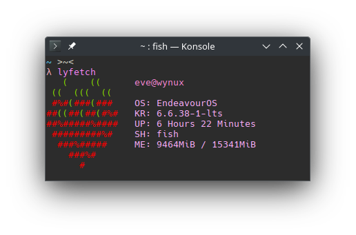

# Lyfetch.rs

Lyfetch.rs is a rust rewrite of it's [bash predecessor](https://github.com/its-Lyn/lyfetch). <br>

Small and quick system information script for linux systems~

<p align="center">
  
</p>

## Installation

### Prerequisites
Installing lyfetch is quite easy! All you need installed is git and rustup.
```bash
# Installing git
## Fedora/Ubuntu
sudo apt/dnf install git
## Arch and Arch Based distros
sudo pacman -S git

# Installing Rust
curl --proto '=https' --tlsv1.2 -sSf https://sh.rustup.rs | sh
```

### Compilation
```bash
git clone https://github.com/its-Lyn/lyfetch

cd lyfetch
./install.sh
```

## Removal
To remove lyfetch just run the following command
```bash
./install.sh --remove
```
